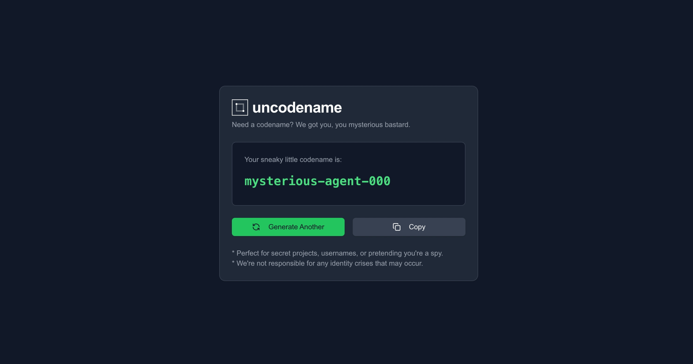

# Uncodename - Secret Codename Generator



A mysterious and powerful codename generator for your secret projects, usernames, or spy adventures. Built with Next.js, TypeScript, and Tailwind CSS.

🔗 **[Check it out: uncodename.com](https://uncodename.com)** - Go generate a codename, you mysterious bastard.

## ✨ Features

- Generate unique codenames combining adjectives and nouns
- Smart repetition prevention system
- Cryptographically secure random generation
- Sleek, dark-mode interface
- Animated text transitions
- One-click copy functionality
- Fully responsive design

## 🚀 Tech Stack

- [Next.js 15](https://nextjs.org/)
- [TypeScript](https://www.typescriptlang.org/)
- [Tailwind CSS](https://tailwindcss.com/)
- [Framer Motion](https://www.framer.com/motion/)
- [Shadcn](https://ui.shadcn.com/)

## 🛠️ Installation

1. Clone the repository:

```bash
git clone https://github.com/background-craft/uncodename.git
cd uncodename
```

2. Install dependencies (pnpm recommended for Next.js 15 + shadcn):

```bash
# recommended
pnpm install

# or if you prefer
npm install
yarn install
```

3. Run the development server:

```bash
# recommended
pnpm dev

# or if you prefer
npm run dev
yarn dev
```

4. Open [http://localhost:3000](http://localhost:3000) in your browser.

## 🎯 Usage

Simply visit the website and click the "Generate Another" button to create new codenames. Click the "Copy" button to copy the generated codename to your clipboard.

## 🤝 Contributing

Contributions are welcome! Feel free to submit issues and pull requests.

1. Fork the repository
2. Create your feature branch (`git checkout -b feature/amazing-feature`)
3. Commit your changes (`git commit -m 'Add some amazing feature'`)
4. Push to the branch (`git push origin feature/amazing-feature`)
5. Open a Pull Request

## 📝 License

This project is licensed under the MIT License - see the [LICENSE](LICENSE) file for details.

## 🌟 Credits

Created by [Background Craft](https://backgroundcraft.com). Don't blame us if your new identity is too powerful.

---

Note: This project is meant for entertainment purposes. Any resemblance to actual secret agents or spy organizations is purely coincidental... or is it? 🕵️‍♂️
